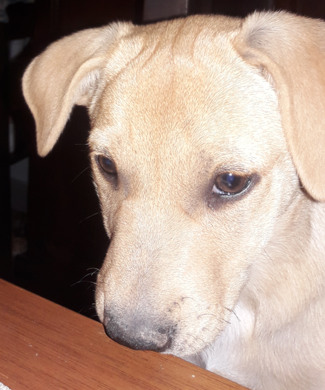

# Presentacion Personal
Mi nombre es Martin y es mi primer cuatrimestre en la tec. en programacion, decidi pasarme desde la tec. en informatica

### Materias Aprobadas
* Astros
* Base de datos
* Ingles 1 y 2
* Mate 1
* Intro a la prog (reg)
* Base de datos
* La vida secreta de las rocas
* Nuevos entornos
* Org. de computadoras
* Redes (reg)